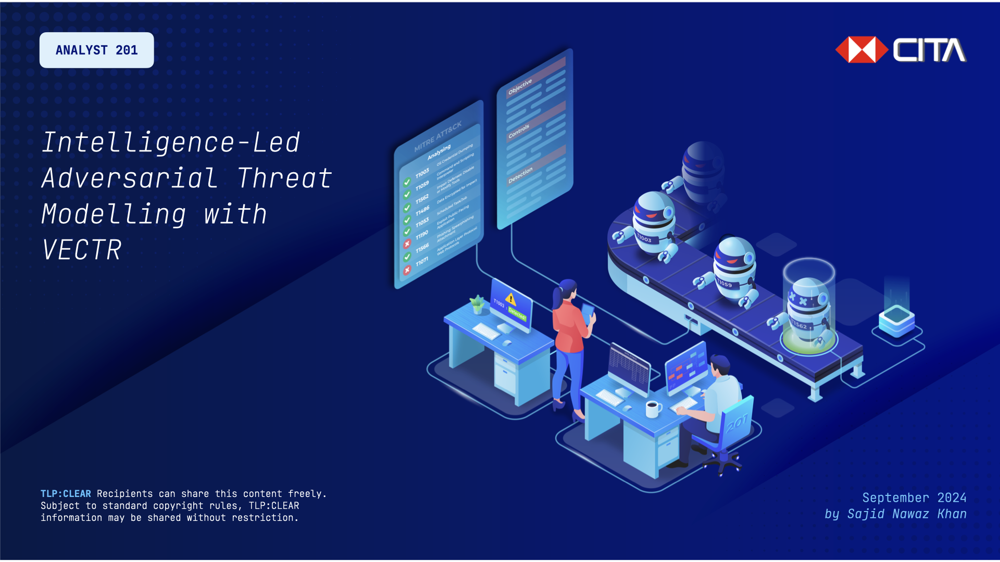

# Strategic Intelligence for Threat Hunting (SITH)

## Intelligence-Led Adversarial Threat Modelling with VECTR

More and more organisations are beginning to realise the value of ATT&CK. But how can you bring your teams together to help develop and nurture an operational  framework which consistently yields results?

This presentation details the approach developed by the Cyber Threat Intelligence team of a global bank, and how it worked together with defensive and offensive teams to deliver a compelling solution to uplift the organisations' security posture; one adversarial TTP at a time.

The corresponding workshop is designed to provide practical guidance to practitioners that they can adapt for their organisations. Key learning objectives include transforming countermeasure initiatives to be intelligence-led, and developing and deploying a threat library.

by Sajid Nawaz Khan, _Principal Cyber Threat Intelligence Analyst_

___

## Logging into VECTR
You can access VECTR at https://sravectr.internal:8081/ with default credentials: `admin`::`11_ThisIsTheFirstPassword_11`
